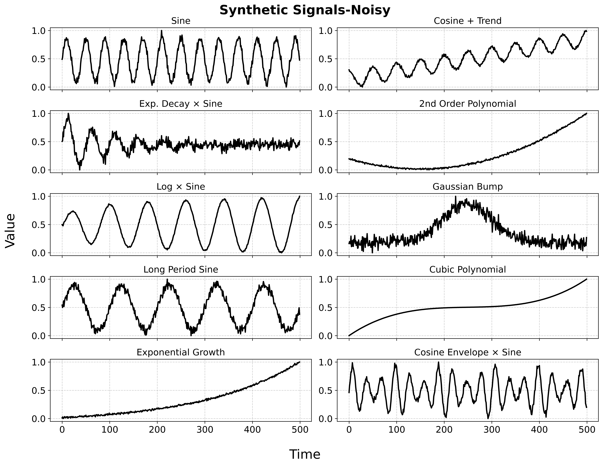

````markdown
# CompactFormer

**CompactFormer** is a modular, research-grade Python package for unified transformer-based time series forecasting. 

It implements and benchmarks PatchTST, Autoformer, and Informer variants, supporting grid search, reproducible experiments, and high-quality result visualizations.

This repository contains the code and experiments used for the study of Transformer-based architectures for time series forecasting, as presented in the article "Synthetic Time Series Forecasting with Transformer Architectures: A Comparative Study of Autoformer, Informer, and PatchTST".

The study compares three prominent Transformer models—Autoformer, Informer, and PatchTST—evaluating their performance on a variety of synthetic time series signals.

The main goal of this study is to provide a comprehensive evaluation of these architectures under different conditions, including noise and varying forecast horizons.

The results help identify the strengths and weaknesses of each architecture, guiding model selection for specific time series forecasting tasks.


---

## Features

- ✅ PatchTST, Autoformer, and Informer variants in PyTorch
- ✅ Modular, extensible design for research and fast benchmarking
- ✅ Ready-made grid search scripts for robust model evaluation
- ✅ Utilities for synthetic and noisy signal generation
- ✅ Standardized plotting and CSV export for reproducibility
- ✅ CLI entry points and Python importable API
- ✅ Easy integration with custom datasets

---

## Installation

Clone the repository and install in **editable/development mode** (recommended for research):

```bash
git clone git@github.com:Ali-Forootani/compactformer.git
cd compactformer
pip install -e .
````

**Requirements:**

* Python 3.10.\*
* numpy==1.24.4
* pandas==1.5.3
* matplotlib==3.7.1
* scikit-learn==1.2.2
* scipy==1.10.1
* torch==2.0.1

All dependencies are specified in [`pyproject.toml`](./pyproject.toml).

---

## Project Structure

```
compactformer/
│
├── compactformer/
│   ├── __init__.py
│   ├── autoformer.py
│   ├── datasets.py
│   ├── eval.py
│   ├── informer.py
│   ├── patchtst.py
│   ├── plots.py
│   ├── signals.py
│   ├── train.py
│   └── utils.py
│
├── scripts/
│   ├── __init__.py
│   ├── run_autoformer_grid.py
│   ├── run_informer_grid.py
│   └── run_patchtst_grid.py
│
├── simulation_results/
│   └── pictures/
│       ├── noisy_signals_for_transformers.png
│       ├── patchtst_comparison_3x4.png
│       ├── informer_comparison_3x4.png
│       └── autoformer_comparison_3x4.png
│
├── setup.py
├── pyproject.toml
├── README.md
└── test_module.py
```

---

## Quick Start

### 1. **Run a grid search experiment** via CLI

After installing, you can run grid searches from anywhere (with your conda environment activated):

```bash
compactformer-autoformer-grid
compactformer-informer-grid
compactformer-patchtst-grid
```

Or using direct Python:

```bash
python scripts/run_autoformer_grid.py
python scripts/run_informer_grid.py
python scripts/run_patchtst_grid.py
```

### 2. **Import and use in Python**

```python
from compactformer.patchtst import PatchTSTSimple
from compactformer.signals import generate_noisy_smooth_signals

t, signals = generate_noisy_smooth_signals()
model = PatchTSTSimple(
    patch_length=8, horizon=4, d_model=8, num_heads=2, dim_feedforward=32, num_layers=2
)
```

### 3. **Custom Experiment**

You can modify or extend any script or module, or add your own custom models and datasets.
Results (forecasts, metrics, plots) are saved in the `simulation_results/` directory.

---

## Example Results

**Noisy Signals Example**



**PatchTST Example**


**Informer Example**


**Autoformer Example**


---

## Command-Line Interface

After installation, the following CLI commands are available:

* `compactformer-autoformer-grid`
* `compactformer-informer-grid`
* `compactformer-patchtst-grid`

Each command will run a full grid search experiment and save outputs in `simulation_results/`.

---

## Citing

If you use **CompactFormer** in your research, please cite:

```
Ali Forootan. "Synthetic Time Series Forecasting with Transformer
Architectures: A Comparative Study of
Autoformer , Informer , and PatchTST", 2025.
```

(Add DOI/citation when published.)

---

## License

[MIT License](LICENSE)
(C) 2025 Ali Forootan

---

## Acknowledgements

* Inspired by [Autoformer](https://github.com/thuml/Autoformer), [Informer](https://github.com/zhouhaoyi/Informer2020), and [PatchTST](https://github.com/yuqinie98/PatchTST).
* Built with [PyTorch](https://pytorch.org/).

---

## Contact

For questions, suggestions, or collaboration, contact:
**Ali Forootan** – [aliforootani@ieee.org](mailto:aliforootani@ieee.org)

---

```

---

**Let me know if you’d like to add a “Contributing” section, advanced usage, or any custom badges!**  
You can copy this as your new `README.md`.
```
